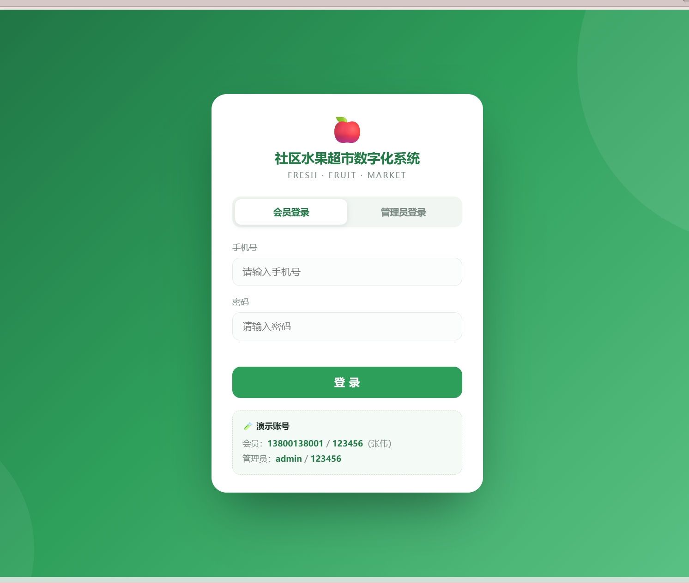
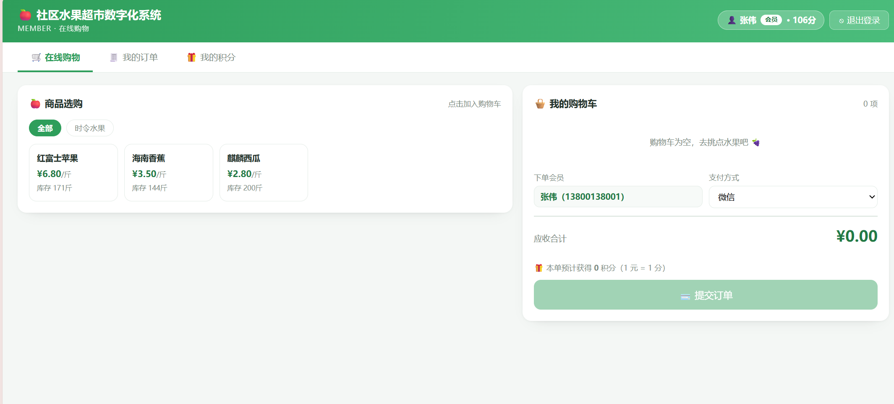
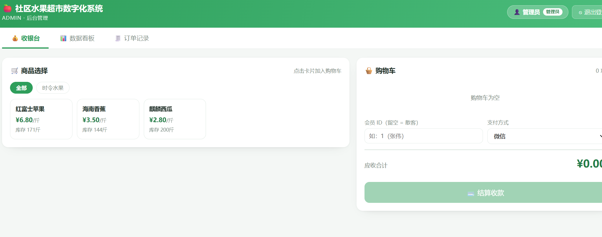
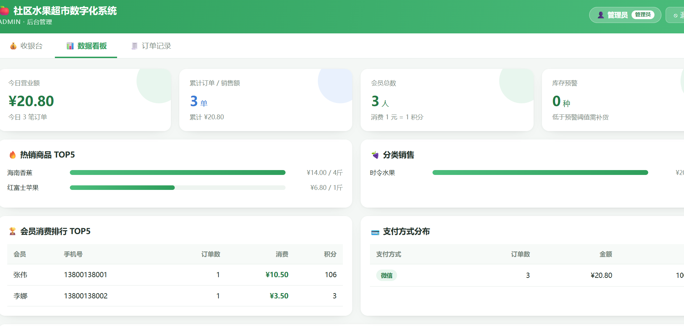

# 🍎 社区水果超市数字化系统

基于 **Spring Boot + MyBatis + MySQL** 的校园水果店数字化管理系统，覆盖
**买家在线购物**和**卖家后台管理**双端。

> Web 程序设计实训项目 · 独立开发 · 2024.03 - 2024.05

---

## ✨ 功能特性

### 买家端
- 🛒 在线购物：商品浏览、分类筛选、购物车、下单
- 🧾 我的订单：查看个人历史订单
- 🎁 我的积分：积分余额、积分流水

### 卖家端
- 💰 收银台：帮顾客下单（会员 / 散客）
- 📊 数据看板：营业额、热销 TOP5、分类销售、会员排行、支付分布、库存预警
- 🧾 订单记录：全部订单查询

### 核心机制
- 🔐 会员 / 管理员双角色登录与权限隔离
- 📦 下单事务：`@Transactional` + `SELECT ... FOR UPDATE` 行锁防超卖
- 🔢 积分规则：消费 1 元 = 1 积分（向下取整）
- ✅ 数据一致性：订单金额、库存账实、积分换算自动校验

---

## 🛠️ 技术栈

| 层级 | 技术 |
|---|---|
| 后端 | Spring Boot 3.2 · MyBatis 3.0 · MySQL 8.0 |
| 前端 | 原生 HTML5 + CSS3 + JavaScript（Fetch API） |
| 构建 | Maven |
| 开发工具 | IntelliJ IDEA · MySQL Workbench · Git |

---

## 📊 数据库设计（8 张表）

| 表名 | 说明 | 关键索引 |
|---|---|---|
| `product` | 商品表 | `category` 普通索引 |
| `inventory` | 库存表（1:1 关联 product） | `(current_stock, warn_threshold)` 组合索引 |
| `member` | 会员表 | `phone` 唯一索引 |
| `staff` | 员工表 | `login_name` 唯一索引 |
| `orders` | 订单表 | `created_at` 索引、`(member_id, created_at)` 组合索引 |
| `order_item` | 订单明细表 | `order_id`、`product_id` 外键 |
| `points_record` | 积分记录表 | `(member_id, created_at)` 组合索引 |
| `stock_log` | 库存流水表 | `(product_id, created_at)` 组合索引 |

**主外键关系：**
```
member ─┬─< orders ─< order_item >─ product ─── inventory
        └─< points_record              └── stock_log
staff ──< orders
```

---

## 🚀 快速开始

### 环境要求
- JDK 17+
- MySQL 8.0+
- Maven 3.6+

### 1. 初始化数据库

```bash
mysql -u root -p < schema.sql
```

### 2. 修改配置

编辑 `src/main/resources/application.yml`：

```yaml
spring:
  datasource:
    url: jdbc:mysql://localhost:3306/fruit_market?...
    username: root
    password: 你的密码
```

### 3. 启动项目

```bash
mvn spring-boot:run
```

或直接在 IDEA 里运行 `FruitMarketApplication.java`。

### 4. 访问系统

打开浏览器访问：**http://localhost:8080**

**演示账号：**

| 角色 | 账号 | 密码 |
|---|---|---|
| 会员 | 13800138001 | 123456 |
| 管理员 | admin | 123456 |

---

## 📷 界面预览

<!-- 把下面的路径换成你自己的截图 -->

### 登录页


### 买家端 - 在线购物


### 卖家端 - 收银台


### 卖家端 - 数据看板


---

## 🔍 关键实现

### 1. 下单事务（防超卖）

```java
@Transactional(rollbackFor = Exception.class)
public Order createOrder(OrderCreateDTO dto) {
    for (OrderCreateDTO.Item it : dto.getItems()) {
        // ★ 行锁：其他事务必须等待本次提交后才能读取
        Product p = inventoryMapper.selectProductForUpdate(it.getProductId());
        if (p.getCurrentStock().compareTo(it.getQuantity()) < 0) {
            throw new BizException(p.getName() + " 库存不足");
        }
        // ... 扣库存、写流水、赠积分
    }
}
```

### 2. 经营看板（多表关联 + 分组聚合）

```sql
SELECT p.name,
       SUM(i.quantity) AS qty,
       SUM(i.subtotal) AS amount
FROM order_item i
JOIN product p ON p.product_id = i.product_id
GROUP BY p.product_id
ORDER BY amount DESC
LIMIT 5;
```

### 3. 数据一致性校验

| 校验项 | SQL 逻辑 |
|---|---|
| 订单金额 | `订单金额 = Σ(明细单价 × 数量)` |
| 库存账实 | `当前库存 = 初始库存 + Σ库存流水` |
| 积分换算 | `积分余额 = Σ积分记录`，且 `1 元 = 1 分` |

---

## 📁 项目结构

```
src/main/
├── java/com/example/fruitmarket/
│   ├── FruitMarketApplication.java
│   ├── common/          # Result / 异常处理
│   ├── entity/          # 8 张表对应实体
│   ├── mapper/          # MyBatis Mapper 接口
│   ├── service/         # 业务逻辑
│   └── controller/      # RESTful 接口
└── resources/
    ├── application.yml
    ├── mapper/          # Mapper XML
    └── static/
        └── index.html   # 前端单页应用
```

---

## 📌 已知限制

- 密码目前明文存储（课程设计简化），生产环境应使用 BCrypt
- 管理员账号硬编码，未接入 `staff` 表
- 前端未使用 Vue/React 框架，为原生 JavaScript 实现

---

## 📄 License

本项目仅供学习交流使用。
